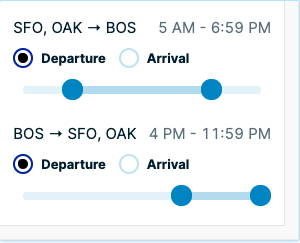

# Coupa Travel Technical Challenge

This challenge is designed to evaluate your ability to solve real-world problems that Coupa Travel has faced while building an online booking tool. You may use any language you like.

### Data

The dataset you will be using is found in [flights.json](./flights.json). It contains a list of 20 real flight search results for a round trip flight search from San Francisco to Boston.

Looking at this array of flight results, you'll see each result is a tuple. The first item in the tuple is the outbound flight, and the second item is the return flight. Each flight object contains some fields (price, score) and a `segmentsArray` which contains the list of flight segments. A flight with only one flight sem

- Identify the various objects in this data.

### The Challenge

1. **Flight Summary**

   Write a function that accepts a flight segment and prints a one-line summary of that flight. The summary should include any origin, destination, and layover airports separated by an arrow (->), total flight time, and a list of flight numbers.
   For example, for a flight with one layover in SLC:

   ```
   SFO -> SLC -> BOS [409 minutes] (DL 1211, DL 745)

   ```

2. **Find Layovers**

   Write a function that accepts a number of layovers and an either outbound or return designation, and prints a flight summary of that flight. Use the function you wrote in step 1 to print the flight summaries.

   ```JavaScript
   function findFlightsWithNumLayovers(numLayovers, flightDirection) {}
   ```

   For example, lets say there are two outbound flights that have one layover.
   Calling `findFlightsWithNumLayovers(1, 'outbound')` would print

   ```
   SFO -> SLC -> BOS [409 minutes] (DL 1211, DL 745)
   SFO -> DFW -> BOS [450 minutes] (DL 123, DL 789)

   ```

   Calling the function again with 0 as the layover count would print flights with no layovers:

   ```
   SFO -> BOS [200 minutes] (UA 123)
   SFO -> BOS [202 minutes] (AA 678)

   ```

   The function should log an error if invalid input is provided.

3. **Filter Flights**

   Write a function that prints all flights from the dataset that match the provided filters and a flight direction (outbound or return). The filters the function should accept are:

   - number of layovers
   - min price
   - max price
   - total trip duration (in minutes)

   All filters are optional. If none are provided, all flights in that direction are returned. If multiple filters are provided, they should all be applied. If no flights match all provided filters, print "No Results".

   ```JavaScript
   findFlights(
     { numLayovers: 0, minPrice: 0, maxPrice: 500 }, // filters
     'return' // flight direction
   );
   ```

4. **Time Filters (Bonus!)**

Update the function you wrote in step 3 to accept filters for the times the flights depart and land. These filters should support a time range for both departure and arrival. This can be represented by four filters:

- departs after (time)
- departs before (time)
- arrives after (time)
- arrives before(time)

You can think this filter as supporting the time slider UI element that many flight booking tools support.


